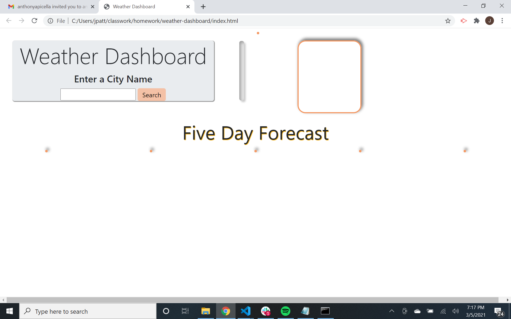
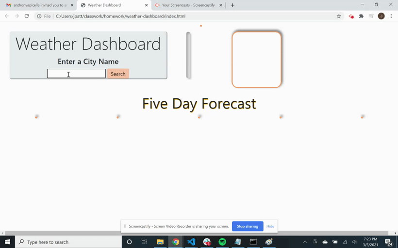
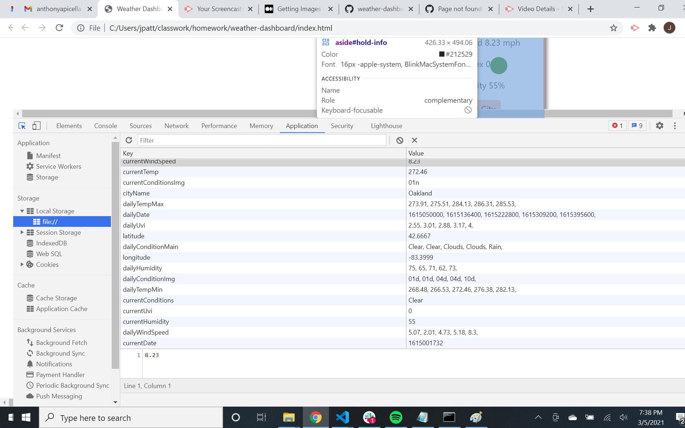

# Weather Dashboard Application

##### Jeffery Patterson
##### 3/5/21 - Last Updated

### Weather Dashboard
This application can be used to find the the current weather data and five day forecast of any known city typed into the search bar. Specifically, the user can find weather data on the current temperature, wind speeds, uvi levels and color, current conditions with current condition image, and the humidity levels for the city. The five day forecast will display the same information except instead of the current temperature (as it is in the future), it will take the max and minimum temperature of the day and display it for the user to read. 

#### On page load..

The user will be displayed with an inital load up page that will show empty boxes. 

If the user does not enter a KNOWN city, the page will show an alert.

Once the user enters a KNOWN city, the page will display the city's current weather forecast, as well as display a five day future forecast as displayed here.

Once the search button is clicked and the information is displayed, you can find all daily information and all current day information stored in local storage.

When the user clicks on the Save City button, the city will be saved and displayed on page reload next to the search button and they can search for other cities without losing their saved city.

### Known Issues
1. Error displaying in the console that says it cannot split null. This is becuase there is nothing in local storage. This is a known issue. There is a note in the javascript explaining this issue. It is something I have had difficulty fixing but will added it to my weaknesses as something I need to strengthen my knowledge of.

2. Inital load up page shows borders, boxes, cards, and shadows of elements that do not exist yet. This became extremely complicated to solve once the code began to grow in number of lines. I have run into this problem multiple times, and will be working on strengthening my knowledge on the topic as well. It does not cause any errors. However, it does make the interface of the design a bit more abstract than needed.

3. Alert instead of Modale - In the future, the alert will be repalced with a modal providing the user with a smoother interface and a design with elements that will be complimented by the overall design of the website. 

4. There is no search history populated. I instead created the save city option for the user which is something I realized I did not have to do. I had misread the directions on the initial homework markdown. I can add a history of cities that were searched for later, and include them in the stored function if I can learn my way around parameters.

