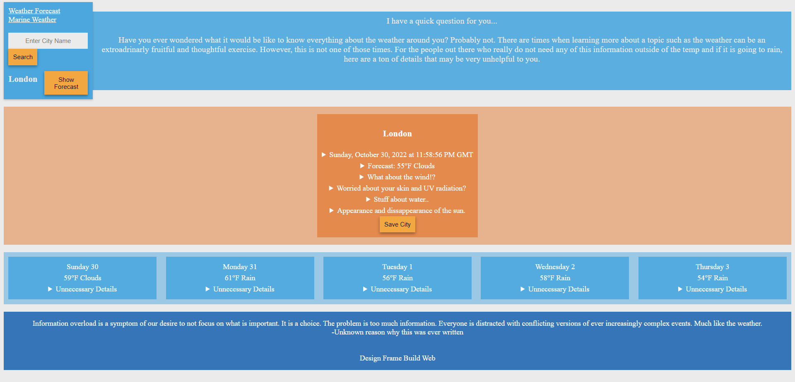

# Weather Dashboard Application

# [Deployed Application](https://jpatterson933.github.io/weather-dashboard/)

# 

# Table of Contents
1. [License MIT](#license-information)
2. [Description](#application-description)
3. [Installation](#installation-instructions)
4. [Usage](#application-usage)
5. [Languages Used](#languages-used)
6. [Contribution Guidelines](#contribution-guidelines)
7. [Testing](#testing-instrutions)
8. [Known Issues/Errors](#known-issues/errors)
9. [Questions](#questions)

# License Information

[MIT License](https://www.mit.edu/~amini/LICENSE.md) Documentation

Please refer to license documentation for any questions regarding reusing 
this software or any code within this application.

[Back to Top](#table-of-contents)

# Application Description

Get your mind blown by some serious data! 

App provides weather data on cities that you search for using an open API weather.

You can also save a city to look at it later. If you erase your cookies, you will erase our very existence. 

[Back to Top](#table-of-contents)

# Languages and Used

### HTML
### CSS
### Javascript
### jQuery
### API data fetch and request methods

# Installation Instructions

You can git clone if you would like to download and use it. Data is stored in objects on local storage. API key may be outdated.

[Back to Top](#table-of-contents)

# Application Usage

This application has a singular purpose. The purpose to provide too much information about the weather in any one city. Seriously, if you go to the live website you will see what I am talking about.

Look at any city in the world and then dig deeper into the details! You are your own detective!

Use the app wisely.

[Back to Top](#table-of-contents)

# [Buy Me A Coffee](https://www.buymeacoffee.com/jpatterson)

There are no guidelines for contribution.
# Contribution Guidelines

There are no guidelines for contribution.

1. Fix to issues if a city is not spelled correctly
2. Implement Canvas on top border with pictures of clouds

# Testing Instrutions

No current Testing Instructions

# [Deployed Application](https://jpatterson933.github.io/weather-dashboard/)

[Back to Top](#table-of-contents)

# Known Issues/Errors

Cities must be spelled correctly. If not, it will not be able to locate it.

[Back to Top](#table-of-contents)

# Questions

If you have any questions that have not been answered, please send me an email: jpatterson933@ucla.edu

## Checkout My GitHub!

[Back to Top](#table-of-contents)

### [jpatterson933](https://github.com/jpatterson933)
### [Live Application](https://jpatterson933.github.io/weather-dashboard/)
### [GitHub Repository](https://github.com/jpatterson933/weather-dashboard)
